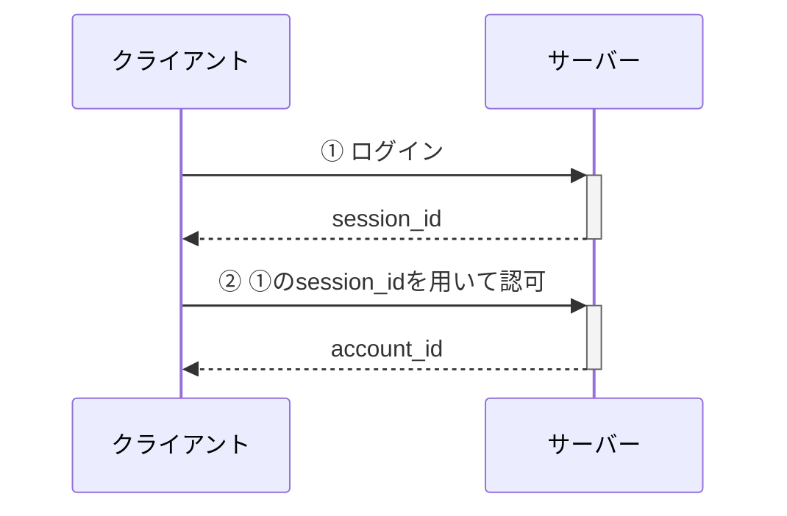

# 概要

認証認可機能を作成する.

# 対象範囲

## 達成基準

- ログイン用エンドポイントが作成されている
- ログアウト用エンドポイントが作成されている
- 認可用エンドポイントが作成されている

## 除外項目

- アカウント機能の対応は行わない

# 利用方法

| パス | メソッド | 備考 |
| --- | --- | --- |
| /signin | POST | ログイン |
| /signout | DELETE | ログイン |
| /authorization | GET | 認可 |

## シーケンス

# 詳細設計

## 要件

- パスワードを用いてログインを行う
- ログアウトを行える
- 認可を行える

## 仕様

- ログイン時にランダムな文字列のセッションIDを発行する
  - セッションIDは32文字
  - セッションIDの有効期限は1週間
- セッションIDを削除することでログアウトを行う
- セッションIDを用いて認可を行う
  - アカウントIDを返却する

## ドメインオブジェクト

| キー | 型 | 備考 |
| --- | --- | --- |
| session_id | string | 32文字 |
| account_id | uuid | |
| expires_at | time | 1週間 |

## テーブル

| カラム名 | 型 | キー | null許容 | 備考 |
| --- | --- | --- | :---: | --- |
| session_id | char(32) | PK | | セッションID |
| account_id | char(36) | FK | | アカウントID |
| expires_at | datetime(6) | | | 有効期限 |
| created_at | datetime(6) | | | 作成日時 |
| updated_at | datetime(6) | | | 更新日時 |
| deleter_at | datetime(6) | | * | 削除日時 |

## テスト項目

### ログイン

| ステータス | テストケース | 入力値 |
| --- | --- | --- |
| 正常系 | ログイン成功 | account_name: name password: password |
| 異常系 | アカウントが存在しない | account_name: NAME password: password |
| 異常系 | パスワードが異なる | account_name: name password: PASSWORD |

### ログアウト

| ステータス | テストケース | 入力値 |
| --- | --- | --- |
| 正常系 | ログアウト成功 | session_id |
| 異常系 | セッションが存在しない | session_id |

### 認可

| ステータス | テストケース | 入力値 |
| --- | --- | --- |
| 正常系 | 認可成功 | session_id |
| 異常系 | セッションが存在しない | session_id |

# その他の手法

# 参考文献

# 変更履歴

| 変更日 | 変更者 | 変更内容 |
| --- | --- | --- |
| 2025/03/16 | @atsumarukun | 初版 |
