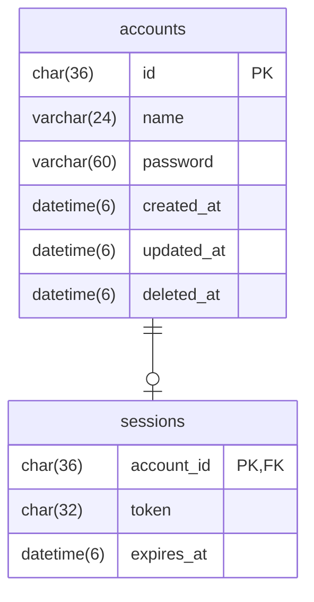

```mermaid
erDiagram

accounts {
  char(36) id PK
  varchar(24) name
  varchar(60) password
  datetime(6) created_at
  datetime(6) updated_at
  datetime(6) deleted_at
}

sessions {
  char(36) account_id PK, FK
  char(32) token
  datetime(6) expires_at
}

accounts ||--o| sessions: ""
```
